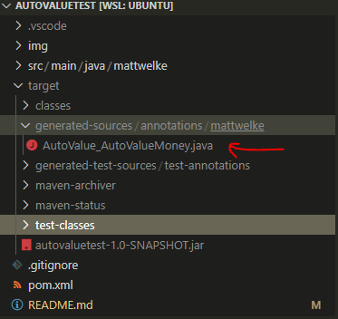

# autovaluetest

Demonstrates using Google's AutoValue library to generate value classes.

Example steps are for use with VS Code as IDE:

1. Run `mvn install` to download JARs for dependencies into your local repository.
1. Run `mvn compile` to build source code, which will include an annotations processor that first generates the AutoValue classes into `target/generated-sources`.

Every time code is edited in VS Code, the annotation processor will run, updating the generated sources. This means you don't need to run `mvn compile` after editing code to run it in VS Code:


The mechanism that does this is unclear to me right now, but it provides a good experience as a developer. Edit code, and it's runnable.

The generated file will be here:



And it will look like this:

```java
package mattwelke;

import javax.annotation.processing.Generated;

@Generated("com.google.auto.value.processor.AutoValueProcessor")
final class AutoValue_AutoValueMoney extends AutoValueMoney {

  private final String currency;

  private final long amount;

  AutoValue_AutoValueMoney(
      String currency,
      long amount) {
    if (currency == null) {
      throw new NullPointerException("Null currency");
    }
    this.currency = currency;
    this.amount = amount;
  }

  @Override
  public String getCurrency() {
    return currency;
  }

  @Override
  public long getAmount() {
    return amount;
  }

  @Override
  public String toString() {
    return "AutoValueMoney{"
        + "currency=" + currency + ", "
        + "amount=" + amount
        + "}";
  }

  @Override
  public boolean equals(Object o) {
    if (o == this) {
      return true;
    }
    if (o instanceof AutoValueMoney) {
      AutoValueMoney that = (AutoValueMoney) o;
      return this.currency.equals(that.getCurrency())
          && this.amount == that.getAmount();
    }
    return false;
  }

  @Override
  public int hashCode() {
    int h$ = 1;
    h$ *= 1000003;
    h$ ^= currency.hashCode();
    h$ *= 1000003;
    h$ ^= (int) ((amount >>> 32) ^ amount);
    return h$;
  }

}
```
