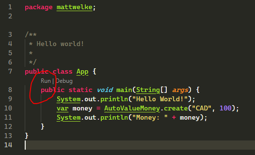

# autovaluetest

Demonstrates using Google's AutoValue library to generate value classes.

Example steps are for use with VS Code as IDE:

1. Run `mvn install` to download JARs for dependencies into your local repository.
1. Run `mvn compile` to build source code, which will include an annotations processor that first generates the AutoValue classes into `target/generated-sources`.

Every time code is edited in VS Code, the annotation processor will run, updating the generated sources. This means you don't need to run `mvn compile` after editing code to run it in VS Code:

The mechanism that does this is unclear to me right now, but it provides a good experience as a developer. Edit code, and it's runnable.
